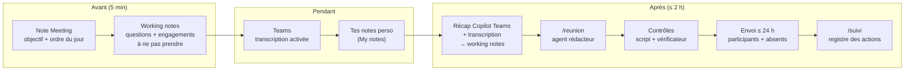
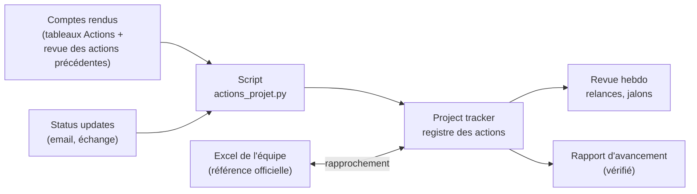

# Workflows

1. [De la réunion au compte rendu professionnel](#1-de-la-réunion-au-compte-rendu-professionnel)
2. [Suivi de projet : actions, planning, avancement](#2-suivi-de-projet--actions-planning-avancement)

---

## 1. De la réunion au compte rendu professionnel



### Qui fait quoi

| # | Étape | Qui | Outil | Résultat |
|---|---|---|---|---|
| 1 | Créer la note `Meeting` (objectif, ordre du jour, participants, `previous_meeting`) | Toi | Obsidian, modèle `Meeting` | Note diffusable prête à remplir |
| 2 | Créer les working notes (clic sur le lien) : tes questions, **engagements à ne pas prendre**, actions ouvertes de la réunion précédente | Toi | Obsidian, modèle `Meeting working notes` | Préparation privée |
| 3 | Lancer la **transcription** dès le début ; annoncer qu'un compte rendu sera envoyé pour confirmation | Toi | Teams | Transcription complète |
| 4 | Prendre tes notes (décisions, actions, doutes, impressions) | Toi | Working notes, `My notes` | Notes brutes |
| 5 | Récupérer le **récap Copilot** (modèle de récap adapté au type) et la **transcription** | Toi | Teams → working notes (`Teams recap`, `Transcript`) | Matériau complet |
| 6 | Lancer `/reunion` depuis la note Meeting | Toi | VS Code | — |
| 7 | **Mettre au propre tes notes** : classées par point de l'ordre du jour, complétées par le récap et la transcription (chaque ajout sourcé) | Agent rédacteur | Working notes, `Clean notes` | Notes propres, notes brutes intactes |
| 8 | **Contrôle de compréhension** : tes notes comparées à la transcription | Agent rédacteur | Working notes, `Understanding check` | Ce que tu as mal compris ou manqué |
| 9 | **Contrôle de cohérence** : ce qui a été dit comparé à ce que le projet sait (Topics, décisions, RAID, Jira) | Agent rédacteur | Working notes, `Consistency check` | Nouveautés, changements, contradictions |
| 10 | **Rédiger le compte rendu** : synthèse, décisions, actions (un responsable, une échéance), revue des actions précédentes, discussion par point, prochaine réunion | Agent rédacteur | Note Meeting | Compte rendu diffusable |
| 11 | **Tracer** chaque élément (D1, A1…) vers sa source | Agent rédacteur | Working notes, `Traceability` | Preuve de chaque élément |
| 12 | **Contrôle automatique** : rien d'interne dans le compte rendu, actions complètes, tout tracé | Script `verifier_compte_rendu.py` | Terminal VS Code | 0 bloquant |
| 13 | Workshop client : brouillon d'email « minutes for confirmation » → **vérification indépendante** | Agents rédacteur → vérificateur | Working notes, `Draft email` | Email vérifié |
| 14 | **Relire** le compte rendu (2 min) : ton, engagements, noms, dates | Toi | Obsidian | Validation |
| 15 | **Envoyer** sous 24 h (participants + absents) ; `minutes_status: sent` | Toi | Outlook | Compte rendu diffusé |
| 16 | Mettre à jour le vault (faits, décisions, RAID, engagements) | Agent rédacteur (`mise-a-jour-vault`) | Obsidian | Base documentaire à jour |
| 17 | Mettre à jour le **registre des actions** du projet | Agent suivi-projet (`/suivi`) | Project tracker | Qui fait quoi pour quand |

### Les règles qui font un compte rendu professionnel
- **Deux notes** : le compte rendu (diffusable tel quel) et les working notes (jamais diffusées).
- **Actions** : un verbe + un livrable, **un seul responsable**, une **échéance**, un critère d'achèvement.
  Responsable ou date non dits → `TBD`, à faire confirmer, jamais inventés.
- **Contenu** : factuel, neutre, au passé ; pas d'opinion ; exigences et engagements cités mot pour mot.
- **Délais** : rédiger dans les 2 heures, envoyer sous 24 heures, à tous les participants **et aux absents**.
- **Confirmation** (workshop client) : demander confirmation sous 5 jours ouvrés, sans réponse = validé.
- Détail : `.github/skills/compte-rendu-reunion/regles-compte-rendu.md`.

---

## 2. Suivi de projet : actions, planning, avancement



### Principe
- **Une action naît dans un compte rendu** (tableau `Actions`) et son statut évolue dans les réunions suivantes
  (tableau `Previous actions review`, relié par `previous_meeting`) ou hors réunion (tableau `Status updates`
  du tracker, avec la source).
- **Le script consolide** toutes les actions du projet : en retard (avec le nombre de jours), sous 7 jours,
  à confirmer, autres, par responsable, et signale les anomalies. Le calcul n'est jamais fait par l'IA.
- **L'agent suivi-projet** interprète : jalons et planning (diagramme Gantt), attentes envers les autres,
  décisions à obtenir, relances, rapport d'avancement.
- **L'Excel de l'équipe reste la référence officielle** : le rapprochement liste les écarts et prépare les
  mises à jour, dans les deux sens.

### Rythme

| Quand | Commande | Ce que tu obtiens |
|---|---|---|
| Après chaque compte rendu | `/suivi <projet>` | Registre à jour, retards et échéances de la semaine |
| Une info arrive par email | Ligne dans « Status updates » du tracker, puis `/suivi` | Statut à jour avec sa source |
| Avant la réunion interne | Agent suivi-projet : « rapprochement Excel <projet> <fichier> » | Écarts vault / Excel, mises à jour prêtes |
| Revue hebdomadaire (vendredi) | `/suivi`, puis « relances <projet> » | Emails de relance vérifiés pour les actions en retard des autres |
| Question du chef de projet | `/point-projet <projet>` | Où on en est en 10 lignes, chaque point sourcé |
| Comité / reporting | `/rapport-avancement <projet>` | Rapport en anglais : RAG, réalisations, jalons, retards, risques, décisions attendues |

### Commande du script (terminal VS Code, racine du vault)
```bash
python outils/actions_projet.py "1 Projects/<Projet>"
```
```bash
python outils/actions_projet.py "1 Projects/<Projet>" --ecrire
```
Sans `--ecrire` : aperçu. Avec `--ecrire` : met à jour le bloc « Actions register » du `Project tracker`
(seulement ce bloc).
