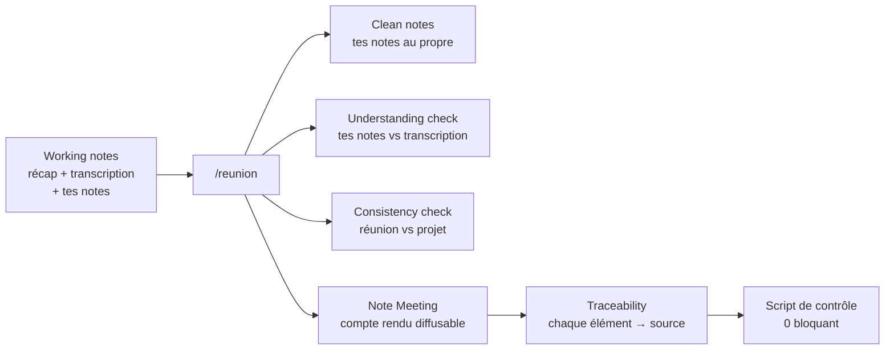

# Workflows

1. [Réunion → compte rendu professionnel](#1-réunion--compte-rendu-professionnel)
2. [Suivi de projet](#2-suivi-de-projet)
3. [Économiser crédits et tokens](#3-économiser-crédits-et-tokens)

> « Requête » = un message envoyé à Copilot avec un modèle premium. Les étapes à **0** ne consomment aucun crédit
> GitHub. Le coût réel d'une requête (et des sous-agents) se mesure une fois à l'étalonnage (kit-setup, étape 4).

---

## 1. Réunion → compte rendu professionnel

### Version express

| # | Quand | Tu fais | Coût |
|---|---|---|---|
| 1 | Avant (5 min) | Note **Meeting** (objectif, ordre du jour) + clic sur le lien **working notes** : tes questions, les engagements à ne pas prendre | 0 |
| 2 | Pendant | **Transcription Teams** activée ; tes notes dans `My notes` | 0 |
| 3 | Après | Colle le **récap Copilot Teams** et la **transcription** dans les working notes | 0 (Copilot 365) |
| 4 | Après | Note Meeting ouverte → **`/reunion`** | **1 requête** |
| 5 | Après | Relis (2 min), corrige à la main si besoin, réponds **« OK »** → vault + registre des actions mis à jour | **1 requête** |
| 6 | ≤ 24 h | Envoie la note Meeting aux participants **et aux absents** | 0 |

**Total : 2 requêtes par réunion** (3 pour un workshop client, avec la vérification de l'email de confirmation).

### Choisir le niveau selon la réunion

| Niveau | Pour | Comment | Coût |
|---|---|---|---|
| **Léger** | Point court, sans décision importante | Colle le récap Teams dans la note Meeting, remplis le tableau Actions à la main | 0 |
| **Standard** | Réunion interne, handover | Version express | 2 requêtes |
| **Critique** | Workshop client, comité, décision d'architecture | Version express + transcription complète + vérification de l'email client | 3 requêtes |

### Ce que `/reunion` fait en une seule réponse



| Où | Ce que tu obtiens |
|---|---|
| Working notes (privées) | Tes notes mises au propre et complétées ; contrôle de compréhension (ce que tu as manqué ou mal compris) ; contrôle de cohérence (nouveau, modifié ou contradictoire par rapport au projet) ; traçabilité ; brouillon d'email client |
| Note Meeting (diffusable) | Synthèse, décisions, actions (un responsable, une échéance), revue des actions précédentes, discussion par point, prochaine réunion |
| Contrôle automatique (script) | Rien d'interne dans la note Meeting, actions complètes, chaque élément tracé |
| Propositions (appliquées après ton « OK ») | Faits et décisions pour le vault, risques, engagements ; registre des actions du projet |

### Règles d'un compte rendu professionnel
- **Deux notes** : la note Meeting est diffusable telle quelle ; les working notes ne sortent jamais.
- **Actions** : verbe + livrable, **un seul responsable**, **une échéance**, un critère d'achèvement ; non dits → `TBD`.
- **Contenu** factuel, neutre, au passé ; exigences et engagements cités mot pour mot.
- **Rédaction sous 2 h, envoi sous 24 h**, participants et absents ; workshop client : confirmation demandée sous 5 jours ouvrés.
- Détail : `.github/skills/compte-rendu-reunion/regles-compte-rendu.md`.

---

## 2. Suivi de projet

| Besoin | Le moyen le plus économique | Coût |
|---|---|---|
| Voir les actions en retard, de la semaine, à confirmer | `python outils/actions_projet.py "1 Projects/<P>"` dans le terminal | **0** |
| Mettre à jour le registre après une réunion | Inclus dans le « OK » de `/reunion` | 0 de plus |
| Info reçue par email (action faite, nouvelle date) | Une ligne dans « Status updates » du Project tracker, puis le script avec `--ecrire` | **0** |
| Jalons, planning (Gantt), attentes, décisions à obtenir | `/suivi <P>` — une fois par semaine, ou quand un jalon bouge | 1 requête |
| « Où en est le projet ? » | `/point-projet <P>` | 1 requête |
| Écarts avec l'Excel de l'équipe | Agent suivi-projet : « rapprochement Excel <P> <fichier> » — avant la réunion interne | 1 requête |
| Relancer les retards des autres | Agent suivi-projet : « relances <P> » — à la revue hebdo | 1-2 requêtes |
| Reporting, comité | `/rapport-avancement <P>` | 2 requêtes (rédaction + vérification) |

Principe : **le script calcule** (consolidation, retards, échéances, gratuit et exact), **l'agent interprète**
(planning, priorités, relances, rapport). L'Excel de l'équipe reste la référence officielle.

```bash
python outils/actions_projet.py "1 Projects/<Projet>"
```
```bash
python outils/actions_projet.py "1 Projects/<Projet>" --ecrire
```

---

## 3. Économiser crédits et tokens

| Règle | Pourquoi |
|---|---|
| **Une commande complète, pas de conversation** : `/reunion` puis « OK ». Les petites corrections se font à la main | Chaque message est une requête |
| **Nouveau chat pour chaque réunion ou sujet** | Un long historique est relu à chaque message : plus de tokens, moins de précision |
| **Scripts dans le terminal** pour tout calcul ou contrôle (actions, conversion, sources, compte rendu) | 0 crédit, résultat exact |
| **Copilot 365 pour capter** (récap Teams, emails, SharePoint, Excel) | Ne consomme pas les crédits GitHub |
| **Transcription** : complète pour un workshop client ou une réunion critique ; pour une réunion interne courante, seulement les passages utiles | La transcription d'une heure représente plusieurs milliers de mots : c'est le principal poste de tokens |
| **Vérificateur seulement pour ce qui sort** (email client, Jira, Confluence, rapport) | Les notes internes sont contrôlées par script, gratuitement |
| **Niveau « léger »** pour les points courts | Toutes les réunions ne méritent pas un compte rendu IA |
| **Modèle gratuit** pour cadrer, convertir, journaliser, emails simples | Coefficient 0 |
| **Mesurer** : `/journal` + relevé du compteur le lundi | Ajuster avec des chiffres réels |
