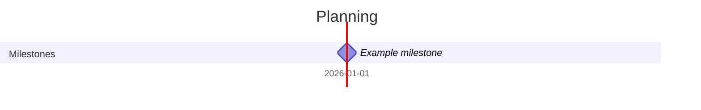

# Project tracker — Demo

> Suivi du projet : où on en est, qui doit faire quoi pour quand. Tenu à jour par l'agent `suivi-projet`
> (commande `/suivi`). Le fichier Excel de l'équipe reste la référence officielle : `/suivi` signale les écarts.

## Actions register
<!-- Bloc généré par outils/actions_projet.py à partir des notes Meeting du projet. Ne pas modifier à la main :
     un changement connu hors réunion (email, échange) se déclare dans « Status updates » ci-dessous. -->
<!-- actions:start -->
<!-- actions:end -->

## Status updates
<!-- Changements de statut connus hors réunion. Action ID = <date de la réunion>/<ID>, ex. 2026-09-15/A2 -->
| Action ID | New status | New due | Date | Source |
|---|---|---|---|---|
| 2026-09-15/A3 | done |  | 2026-10-02 | Email Bob 2026-10-02 |

## Waiting for
<!-- Ce que j'attends des autres (livrables, réponses, décisions) et dont je dépends -->
| What | From | Asked on | Expected | Follow-up |
|---|---|---|---|---|

## Milestones & planning
| Milestone | Baseline | Forecast | Status | Source |
|---|---|---|---|---|

## Decisions needed
<!-- Arbitrages attendus : qui doit décider, avant quand, conséquence d'un retard -->
| Decision needed | From | By when | Impact if late |
|---|---|---|---|

## Status reports
<!-- Historique des rapports d'avancement (lien vers les brouillons Drafts/) -->
| Date | Report | RAG |
|---|---|---|
